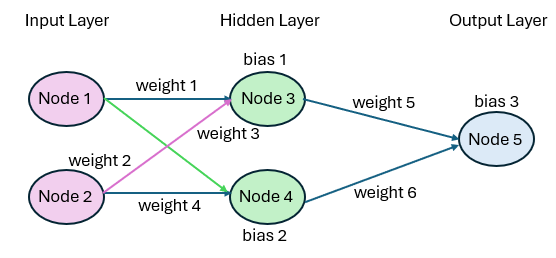
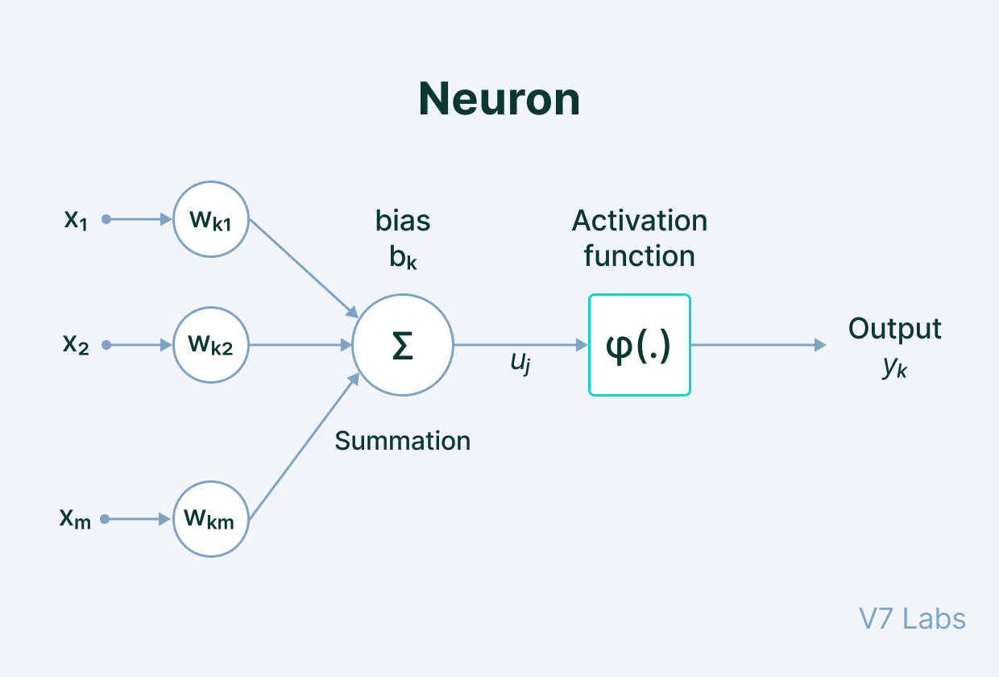

# Neural Networks in Sports Analytics
## What is a Neural Network?

 - A neural network is a statistically trained model that draws inspiration from the human brain
 - In learns from data in order to make predictions
 - It is not explicitly programmed, the key here is that it **learns** 

## Why Use Neural Networks? 

- Able to see **complex relationships** in data
    - Works best with nonlinear patterns
 - Used commonly in many fields including:
    - Image recognition
    - Speech recogniition
    - Sports analytics

## Today's Goal

- Build a simple neural network to predict NBA player performance. We will predict:
    - Points, rebounds, and assists.
- Compare predicted vs actual stats to see how well the neural network predicts

# How Neural Networks Work

## Basic Structure 

- Neural networks are made up of layers of neurons (the human brain has billions of neurons)
  - Input layer
  - Hidden layers
  - Output layer
- Each neuron (or node):
  - Takes in numbers
  - Applies a transformation
  - Passes the result forward

## Flow of Information

- Data moves **forward** through the network
    
- Each layer transforms the data slightly
- Final layer produces a prediction

## Simple Diagram



# What Happens Inside a Neural Network?

## Neurons (Nodes)

- Each circle in the network is called a **neuron/node**
- A neuron:
  - Receives inputs
  - Processes them
  - Passes an output forward
 
## Weights and Bias

- **Weights**:
  - Control how important each input is
  - Larger weight = more influence on the prediction

- **Bias**:
  - A constant added to help shift predictions
  - Allows the model to be more flexible

## Activation Function (ReLU)

- After combining inputs, neurons apply an **activation function**
- We used **ReLU (Rectified Linear Unit)**:

$$
f(x) = \max(0, x)
$$

- This means:
  - If input is negative → output is 0
  - If input is positive → keep it



## Why This Matters

- ReLU helps the model learn **nonlinear patterns**
- This is important because:
  - Player performance is not perfectly linear

# Other Activation Functions

## Sigmoid

- Outputs values between **0 and 1**
- Often used for probabilities

$$
f(x) = \frac{1}{1 + e^{-x}}
$$

- Limitation:
  - Can slow down learning in deeper networks

## Tanh (Hyperbolic Tangent)

- Outputs values between **-1 and 1**
- Centered at 0 (helps learning compared to sigmoid)

$$
f(x) = \tanh(x)
$$

- Still can have issues with slow learning in deep networks

## Key Takeaway

- Different activation functions change how the model learns patterns
- ReLU is most common, but others are useful in specific situations


# Example of a Neural Network in Sports Statistics


```{python}
#| include: false
import pandas as pd
import numpy as np
import matplotlib.pyplot as plt
import glob

seasons = [
    "2018.csv",
    "2019.csv",
    "2020.csv",
    "2021.csv",
    "2022.csv",
    "2023.csv",
    "2024.csv"
]

csv_files = glob.glob("nba-player-data/*.csv")

all_df = pd.concat((pd.read_csv(f) for f in csv_files), ignore_index=True)

# Adding Season to data and renaming
import os

csv_files = glob.glob("nba-player-data/*.csv")

dfs = []

for file in csv_files:
    df = pd.read_csv(file)
    
    # Extract season from filename (example: nba-player-data/2023.csv)
    season = os.path.basename(file).replace(".csv", "")
    df["season"] = int(season)
    
    dfs.append(df)

all_df = pd.concat(dfs, ignore_index=True)

#remove pos column
if "Pos" in all_df.columns:
    all_df = all_df.drop(columns=["Pos"])

#rename columns
all_df = all_df.rename(columns={
    "Player": "player",
    "Age": "age",
    "G": "games",
    "MP": "mpg",
    "FGA": "fga",
    "eFG%": "efg",
    "TRB": "trb",
    "AST": "ast",
    "PTS": "pts"
})
print(all_df.head())

all_df = all_df.sort_values(["player", "season"])

print(all_df.head())

# removing player's first season's previous data

stats = ["age", "games", "mpg", "fga", "efg", "trb", "ast", "pts"]

for stat in stats:
    all_df[f"prev_{stat}"] = all_df.groupby("player")[stat].shift(1)
print(stats)

prev_stats = ["prev_age", "prev_games", "prev_mpg", "prev_fga", "prev_efg", "prev_trb", "prev_ast", "prev_pts"]

all_df = all_df.dropna(subset=prev_stats)

all_df = all_df.dropna(subset=["efg"])

print(all_df.isna().sum())
```

## Data
 - Using Basketball-Reference.com, I imported these eight stats from players in the NBA since the 2019 season
 - Data cleaning: 0 and NA are not the same thing in this context

<details>
<summary>Click to expand code</summary>
```{python}
lebron_df = all_df[all_df["player"] == "LeBron James"] \
    .sort_values("season")[
        ["player","season", "age", "mpg", "games", "fga", "efg", "pts", "trb", "ast",]
    ]
lebron_df
```
</details>
## Model Structure

- Input features:
  - Previous season stats:
  age, minutes per game (mpg), field goal attempts (fga), effective field goal percentage (efg), points (pts), rebounds (trb), assists (ast)
- Output:
  - Predicted points, rebounds, and assists for the next season

<details>
<summary>Click to expand code</summary>
```{python}
lebron_df_2 = all_df[all_df["player"] == "LeBron James"] \
    .sort_values("season")[
        ["player", "season","prev_age", "prev_mpg", "prev_games", "prev_fga", "prev_efg", "prev_pts", "prev_trb", "prev_ast",]
    ]
lebron_df_2
```
</details>

## Inputs & Targets

- We started with stats from 2018 - 2024. We dropped the first year, because this year has no 'previous season'. 
```{python}
#| include: false
# Assigning previous season stats as features / inputs
X = all_df[[
    "prev_age",
    "prev_games", 
    "prev_mpg", 
    "prev_fga", 
    "prev_efg", 
    "prev_pts", 
    "prev_trb", 
    "prev_ast"
]]

# Targets: this season's points, rebounds and assists. 
y = all_df[["pts","trb","ast"]]

```

## Architecture

- Input layer → 8 features
- Hidden Layer 1 → 64 neurons (ReLU)
- Hidden Layer 2 → 32 neurons (ReLU)
- Output Layer → 3 neurons (PTS, TRB, AST)


## Why 64 and 32?

- More neurons = more ability to learn patterns
- First layer (64):
  - Captures complex relationships in player stats
- Second layer (32):
  - Refines and simplifies those patterns

## Training the Model

- The model learns by adjusting:
  - Weights
  - Biases

<details>
<summary>Click to expand code</summary>
```{python}
# Scaling 
from sklearn.preprocessing import StandardScaler

scaler = StandardScaler()
X_scaled = scaler.fit_transform(X)
```
</details>

- Random training/testing split, rows are shuffled before splitting so the model sees different players and different seasons
- **random_state=42** sets the random seed just so the data splits the same time every run.  

```{python}
# Train/test split

from sklearn.model_selection import train_test_split

X_train, X_test, y_train, y_test = train_test_split(
    X_scaled,
    y,
    test_size = 0.2,
    random_state = 42
)
print(X_train.shape)
print(X_test.shape)
print(y_train.shape)
print(y_test.shape)
```

## Epochs
- Used TensorFlow library which has tools to create, train, and optimize neural networks
- We trained for 50 **epochs**
  - Each epoch = one full pass through the training data 
  - Each epoch looks through the data 32 rows at a time (batch_size)
- **Train Loss** = error on the data the model is learning from (learning)
- **Validation Loss** = error on the data the model has NOT trained on (generalization)


## Back Propagation
- **What to change**
- Determines how much each weight contributes to the prediction error  
- Works **backwards through the network** (output → input)  
- Computes gradients (how each weight should change)  
- Happens automatically during `model.fit()`  
- Provides the information needed to update the weights  

## Stochastic Gradient Descent
- **How to change it**
- Uses the gradients from backpropagation to update weights  
- Adjusts weights to reduce prediction error  
- Runs repeatedly during training  
- Uses **small batches of data (32 rows)** instead of all data at once  
- The optimizer = "adam" is an advanced form of gradient descent that improves efficiency 

- Mean Squared Error (MSE/Train Loss) as the loss function to train the model, and Mean Absolute Error (MAE) as a metric to interpret how far off our predictions were


```{python}

#| include: false
import tensorflow as tf
from tensorflow import keras
from tensorflow.keras import layers

# Define the model
model = keras.Sequential([
    layers.Dense(64, activation="relu", input_shape=(X_train.shape[1],)),
    layers.Dense(32, activation="relu"),
    layers.Dense(3)  # 3 outputs: pts, trb, ast
])

# Compile the model
model.compile(
    optimizer="adam",
    loss="mse",      # mean squared error
    metrics=["mae"]  # mean absolute error
)

history = model.fit(
    X_train,
    y_train,
    epochs=50,
    batch_size=32,
    validation_split=0.2,
    verbose=0
)

import matplotlib.pyplot as plt

plt.plot(history.history["loss"], label="Train Loss")
plt.plot(history.history["val_loss"], label="Validation Loss")
plt.xlabel("Epoch")
plt.ylabel("Loss")
plt.title("Model Training Over Time")
plt.legend()
plt.show()
```


## Key Idea

- The network learns patterns like:
  - “Higher minutes + higher usage → more points”
  - “Aging + lower minutes → possible decline”


# Results and Model Performance

## Overall Accuracy

- MAE = [pts error + trb error + ast error] / 3
  - The model is off by about 1.4 stats per game on average

```{python}
#| echo: false

test_loss, test_mae = model.evaluate(X_test, y_test, verbose=0)

print(f"Model MSE: {test_loss:.3f}")
print(f"Model MAE: {test_mae:.3f}")
rmse = np.sqrt(test_loss)
print("Model RMSE:",rmse)
```

```{python}
#| echo: false

import warnings
warnings.filterwarnings("ignore")

players = ["Jaylen Brown","Jayson Tatum", "Jrue Holiday","Sam Hauser","Kristaps Porziņģis","Luke Kornet", "Al Horford" ]

for player in players:
    row = all_df[all_df["player"] == player].sort_values("season").iloc[-1]

    features = row[[
        "prev_age", "prev_games", "prev_mpg", "prev_fga",
        "prev_efg", "prev_pts", "prev_trb", "prev_ast"
    ]]

    features_scaled = scaler.transform([features])
    pred = model.predict(features_scaled, verbose=0)[0]
    actual = row[["pts", "trb", "ast"]].values

    print(f"\n{player}")
    print(f"Predicted -> PTS: {pred[0]:.2f}, TRB: {pred[1]:.2f}, AST: {pred[2]:.2f}")
    print(f"Actual    -> PTS: {actual[0]:.2f}, TRB: {actual[1]:.2f}, AST: {actual[2]:.2f}")
```

```{python}
#| echo: false
#| fig-height: 4
#| fig-width: 7
#| cache: true


players = ["Jaylen Brown","Jayson Tatum", "Jrue Holiday","Sam Hauser","Kristaps Porziņģis","Luke Kornet", "Al Horford" ]

stats = ["PTS", "TRB", "AST"]

for player in players:
    row = all_df[all_df["player"] == player].sort_values("season").iloc[-1]

    features = row[[
        "prev_age", "prev_games", "prev_mpg", "prev_fga",
        "prev_efg", "prev_pts", "prev_trb", "prev_ast"
    ]]
    features_scaled = scaler.transform([features])

    pred = model.predict(features_scaled, verbose=0)[0]
    actual = row[["pts", "trb", "ast"]].values

    x = np.arange(len(stats))
    width = 0.35

    plt.figure(figsize=(7, 4))
    plt.bar(x - width/2, pred, width, label="Predicted")
    plt.bar(x + width/2, actual, width, label="Actual")
    plt.xticks(x, stats)
    plt.ylabel("Per Game Stats")
    plt.title(f"{player}: Predicted vs Actual")
    plt.ylim(0, 30)
    plt.legend()
    plt.show()
```

# Limitations of This Specfic Model

- Only used basic statistics:
  - Age, minutes, shooting, previous stats, etc
  - Does NOT include: injuries, team changes, role changes, etc

- Dataset is relatively small
  - Fewer examples can limit how well the model learns

- Simple neural network (64 → 32 layers)
  - More complex models could improve performance

- Does not account for:
  - Team system
  - Teammates
  - Coaching changes

# Limitations of Neural Networks in General

- Neural networks require **large amounts of data**
  - Performance suffers with limited or noisy data

- Often difficult to interpret
  - Difficult to understand how predictions are made

- Training can be:
  - Time-consuming
  - Resource-intensive

# Further Reading

- [Other applications of neural networks](https://www.ibm.com/think/topics/neural-networks)
- https://course.elementsofai.com/en-ie/5/1
- [Creating your own neural network in python](https://medium.com/@soukaina./creating-your-first-neural-network-model-in-python-a-detailed-guide-681ce456b90e)